# tasksmaster
# Task Master

## Lab26

An android application which allows users to manage their userTasks . version: 1.0.0

- create a home page has an image and two buttons (add userTasks , all userTasks) to redirect to other activities.

- create an add userTasks page has two text plain (title , descreption) and an add buttons shows a message of submitted.

- create all userTasks page has an image and a back button redirect you back to the home page.

## Home Page
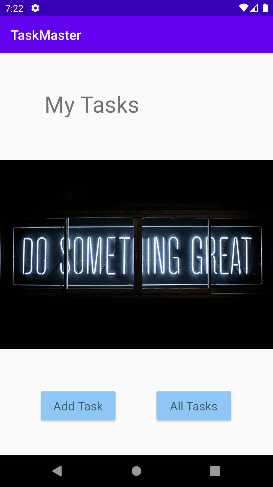

## Add Task Page
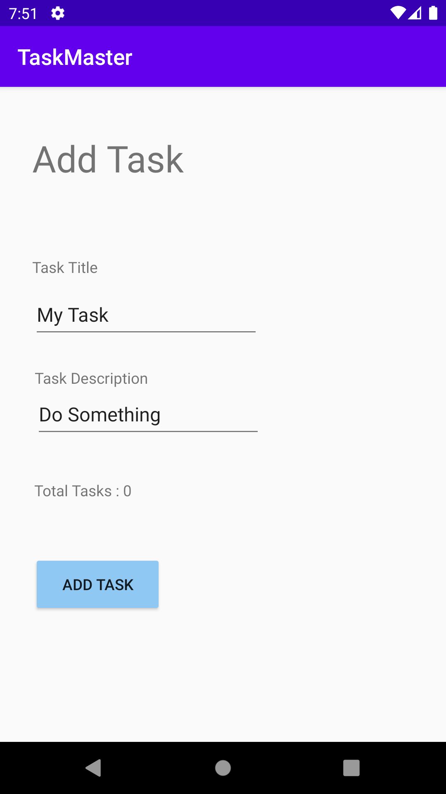

## All Tasks Page
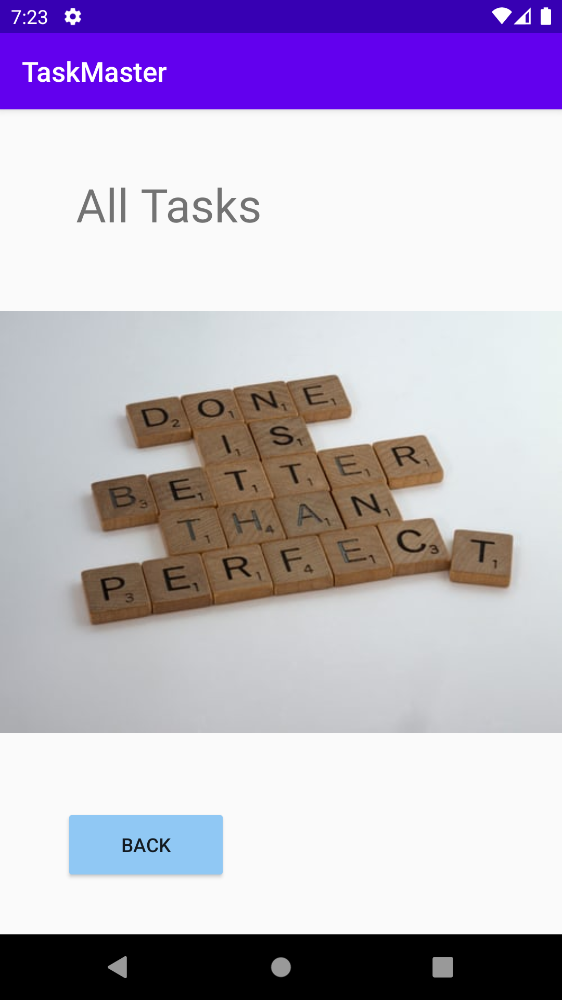

## Lab27

- userTasks details page which shows the userTasks title and the descreption.

- a setting page which the user can change his username from there.

## Home Page
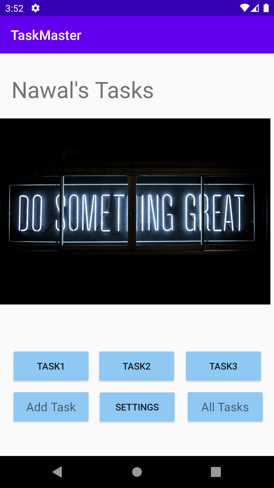

## Settings Page
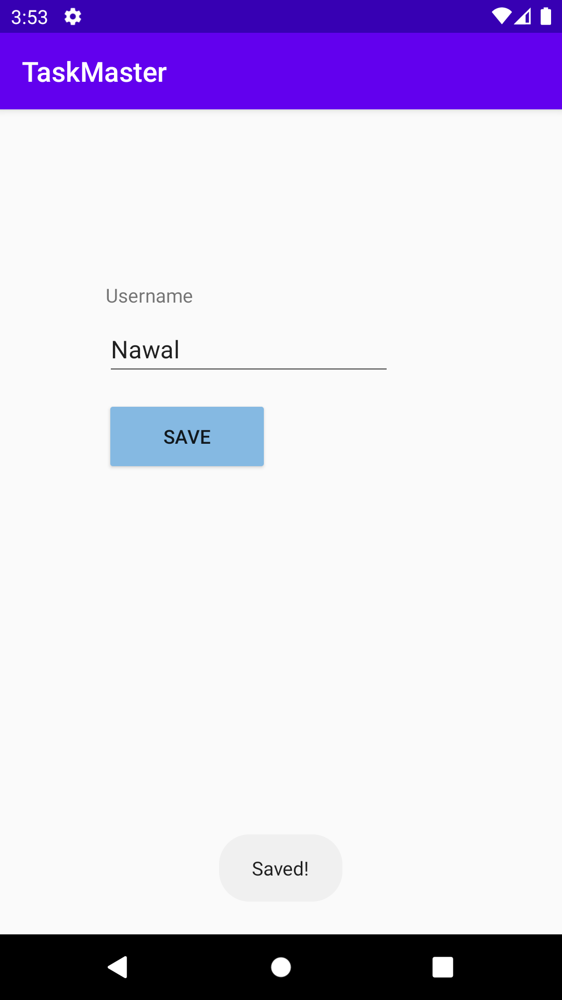

## Task Detail Page

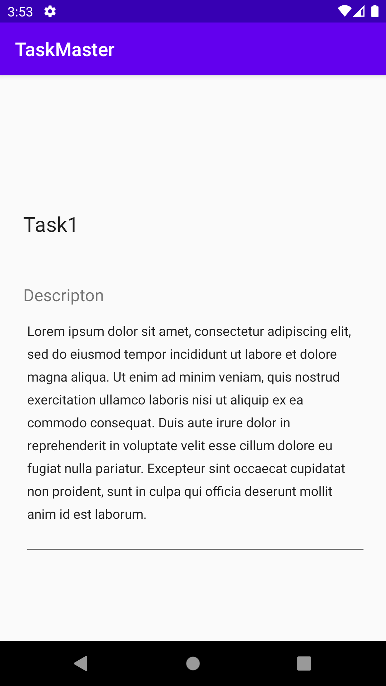

## Lab28
create a recycler view to show 3 hardcoded userTasks.

## Home Page
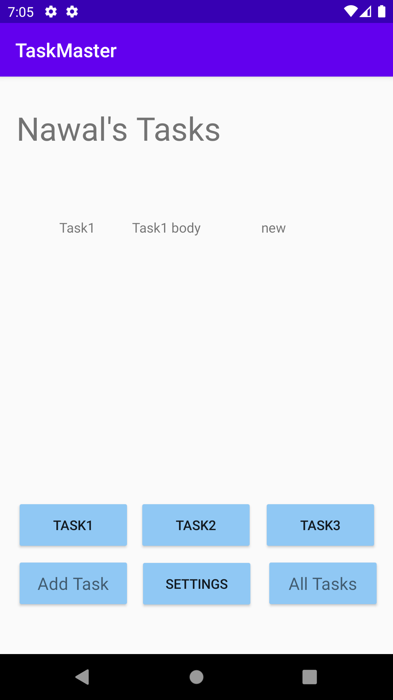

## Lab29
add data base to store data inside.
when adding a new userTasks from add userTasks page the userTasks will be stored in the data base.

## Lab31
Adding Tests for the activities
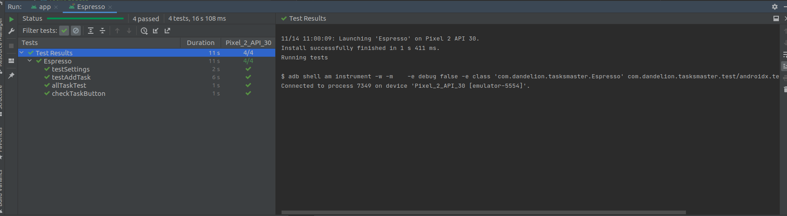

## Lab32 
create a model and table in DynamoDB AWS

## Lab34
build APK for the app.

## Lab36
Authentication (sign up, confirm and login activities)
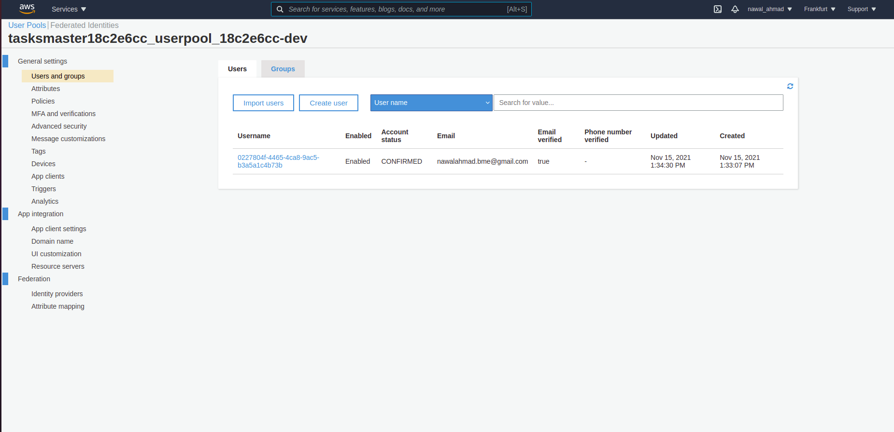
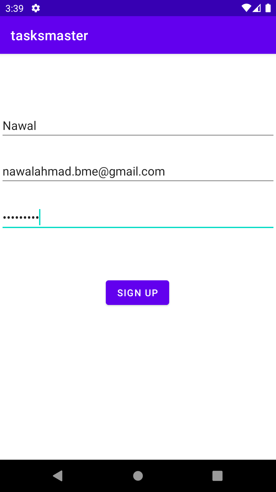

## Lab37
Create Amplify Storage category provides an interface for managing user content for your app in public, protected, or private storage buckets.
The Storage category comes with default built-in support for Amazon Simple Storage Service (S3).
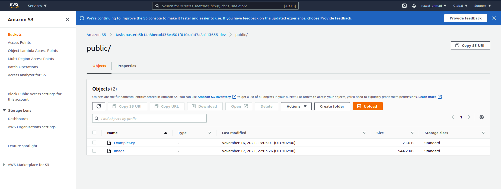

## Lab38
Notifications to be delivered to your app from the cloud

## Lab39
Add Analytics, Create and send an Event whenever you launch intents that start new activities.

